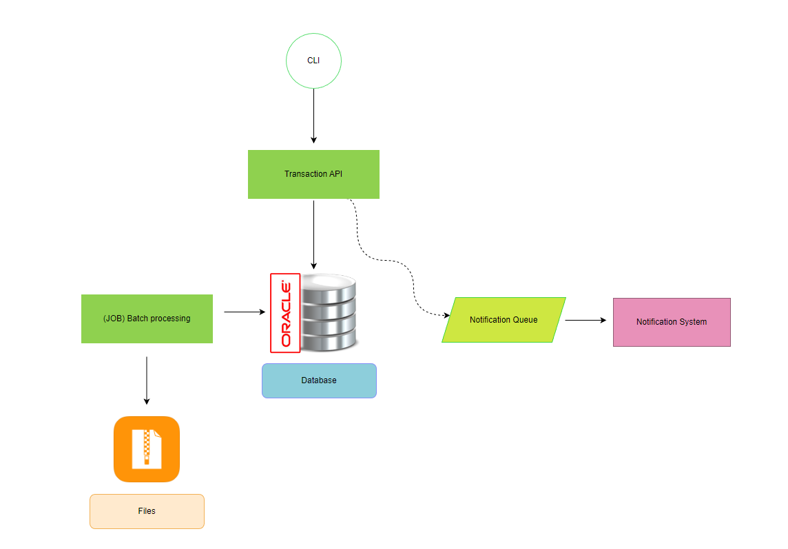
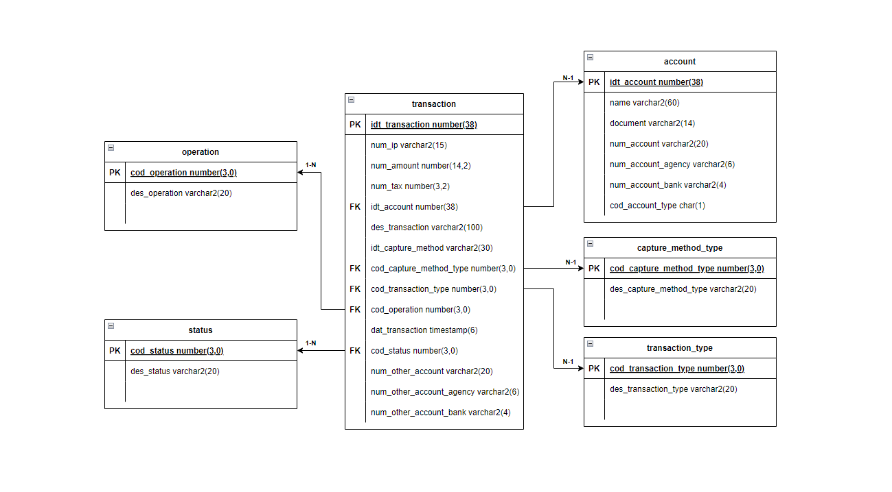
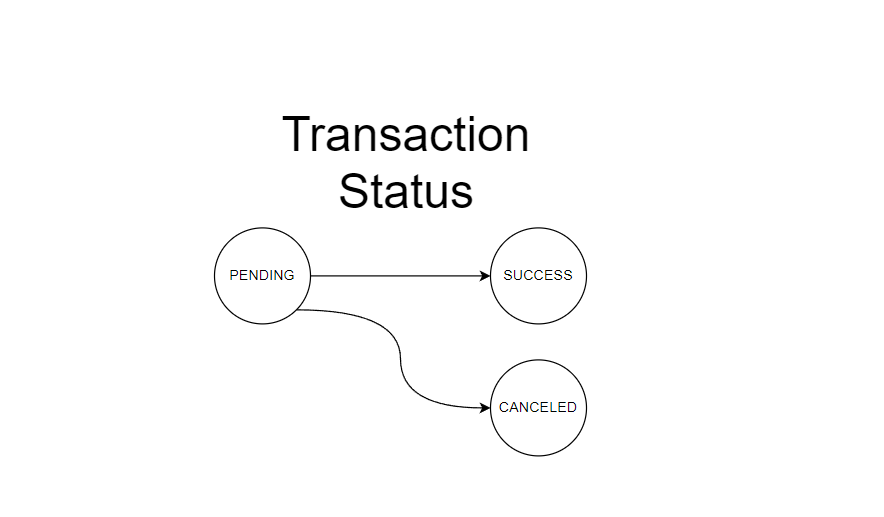

# DIRT-API (Declaração de informações e registro de transações)

This API receives transactions and registers them in a database. The transaction contains details such as IP address,
amount, tax, account ID, description, capture method, transaction type, operation, transaction date and time, status,
and other account details. The capture method specifies the type of device used for the transaction (WEB, APP, or ATM),
while the transaction type indicates the payment method used (PIX, TED, or DOC). The operation field specifies whether
the transaction was a credit or debit. The other account field includes details of the recipient's bank account,
such as account number, agency, and bank code. The API can handle transactions in only pending status. Once received,
the API registers these transactions in the database for future treatment.

### Summary

- [Architecture](#architecture);
- [Installation (Docker)](#running-docker);
- [Database Connection](#database-connection);
- [FlyWay Migration](#flyway-migration);
- [Swagger Documentation And Contract](#swagger-documentation-and-contract);
- [How to use](#how-to-use)

### Architecture



- The transaction API is responsible for the CRUD (Create, Read, Update, and Delete) of transactions and calls the
  database to store the information.

- A batch processing job is responsible for generating report files containing transaction information of accounts.

- There is a mocked service (in pink) available to simulate a notification system.

The database modelling diagram:



The status for transaction are:



The transaction status always starts as pending and can go to success or cancelled, and cannot be changed later.

---

### Development Environment

#### Running Docker

- [Download and install Docker](https://docs.docker.com/get-docker/)
- Run `docker-compose up` to create an instance of the oracle database.
- Wait for the log `DATABASE IS READY TO USE!` before running the application or checking the database.

#### Database Connection

- If you find it necessary to consult the database and validate the connection:
- HOST: localhost
- Service Name: XEPDB1
- PORT: 1521
- USER: dirt
- PASSWORD: sippar123
- URL: jdbc:oracle:thin:@//localhost:1521/XEPDB1

##### Important

In some database administration tools, the default connection is made using SID (System Identifier), which can be
changed to URL or Service Name. However, if you are unable to connect using URL or Service Name, you should pay
attention to the identifier of the PDB (Pluggable Database), which is typically set as SID connection
like: `jdbc:oracle:thin:@localhost:1521:XEPDB1`, resulting in
the [ORA-12505 error](https://docs.oracle.com/en/database/oracle/oracle-database/19/errmg/ORA-12500.html#GUID-BD6AAC21-3F15-4F70-B3C5-064ADCF5EC51),
This occurs because of the use of " :  " in the connection with an unknown SID. In this case, it is necessary to use
Service Name connection " / ". example: `jdbc:oracle:thin:@localhost:1521/XEPDB1`.

---

##### FlyWay Migration

This repository contains the necessary files for performing a database migration using FlyWay. All version scripts are
located in the `db/migration` directory and comply with
the [naming scheme]((https://flywaydb.org/documentation/migrations#naming)) defined by FlyWay.
For more detailed information about FlyWay and its commands, refer to the
official [FlyWay documentation](https://flywaydb.org/documentation/).

Running the application will activate FlyWay and create the schema present
in [V1.1__MODELING_TABLES_RG_6401.sql](./src/main/resources/db/migration/V1.1__MODELING_TABLES_RG_6401.sql) and populate
account using [V1.2__INSERT_TABLES_RG_6401.sql](./src/main/resources/db/migration/V1.2__INSERT_TABLES_RG_6401.sql).

---

#### Swagger Documentation and Contract

The repository provides Swagger documentation for its API endpoints and follows
a [contract](./src/main/resources/static/dirt-api-contract.yaml) to ensure consistent
communication between clients and the server. The Swagger documentation allows developers to explore and interact with
the API, while the contract defines the expected request and response formats.

Running the application the Swagger is available on: `http://localhost:15050/swagger-ui/index.html`

---

#### How to use

The application allows you to submit new transactions for registration in the database. To ensure successful usage of
this endpoint, follow these tips:

- **To register a transaction:**
    - Endpoint: `localhost:15050/transaction`
    - Method: `POST`
    - Request Body:
    ```json
      { 
      "ip": "192.158.1.38", 
      "amount": 99.99, 
      "tax": 10.11, 
      "accountId": 1,
      "description": "Pagto*Manga Zé", 
      "captureMethod": { 
        "id": "123", 
        "type": "WEB" 
        }, 
      "transactionType": "PIX", 
      "operation": "CREDIT", 
      "otherAccount": { 
        "number": "1359764-2", 
        "agency": "0001", 
        "bankCode": "290" 
        } 
      }
    ```
    - Status Code: 201 - CREATED
    - Response:

  ```json
    {
    "transactionId": 1,
    "transactionIp": "192.158.1.38",
    "status": "PENDING",
    "transactionAmount": 99.99,
    "transactionTax": 10.11,
    "description": "Pagto*Manga Zé",
    "transactionType": "PIX",
    "account": {
      "accountId": 1,
      "document": "59805714004",
      "accountName": "Han Solo",
      "accountNum": "5840231-7",
      "accountNumAgency": "0001",
      "accountNumBank": "290",
      "accountType": "F"
       },
    "captureMethod": {
      "id": "123",
      "type": "WEB"
       },
    "operation": "CREDIT",
    "otherAccount": {
      "number": "1359764-2",
      "agency": "0001",
      "bankcode": "290"
      }
    }
  ```
- **To update status of transaction:**
    - Endpoint: `localhost:15050/transaction/{id}`
    - Method: `PUT`
    - Request Parameter `{id}`
        - Description: Transaction ID
    - Request Body:

    ```json
      { 
      "status": "SUCCESS"
      }
    ```
    - Status Code: 200 - OK
    - Response:
  ```json
    {
    "transactionId": 1,
    "transactionIp": "192.158.1.38",
    "status": "SUCCESS",
    "transactionAmount": 99.99,
    "transactionTax": 10.11,
    "description": "Pagto*Manga Zé",
    "transactionType": "PIX",
    "account": {
      "accountId": 1,
      "document": "59805714004",
      "accountName": "Han Solo",
      "accountNum": "5840231-7",
      "accountNumAgency": "0001",
      "accountNumBank": "290",
      "accountType": "F"
       },
    "captureMethod": {
      "id": "123",
      "type": "WEB"
       },
    "operation": "CREDIT",
    "otherAccount": {
      "number": "1359764-2",
      "agency": "0001",
      "bankcode": "290"
      }
    }
  ```

- **To delete a transaction:**
  - Endpoint: `localhost:15050/transaction/{id}`
  - Method: `DELETE`
  - Request Parameter `{id}`
    - Description: Transaction ID
  - Status Code: 200 - OK