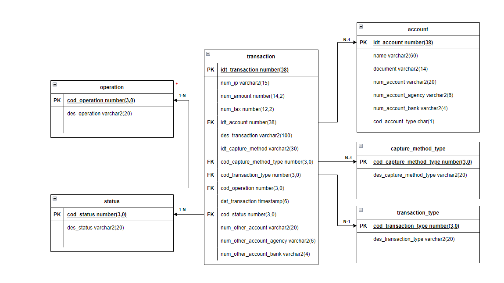

# DIRT-API (Declaração de informações e registro de transações)

This API receives transactions and registers them in a database. The transaction contains details such as IP address,
amount, tax, account ID, description, capture method, transaction type, operation, transaction date and time, status,
and other account details. The capture method specifies the type of device used for the transaction (WEB, APP, or ATM),
while the transaction type indicates the payment method used (PIX, TED, or DOC). The operation field specifies whether
the transaction was a credit or debit. The other account field includes details of the recipient's bank account,
such as account number, agency, and bank code. The API can handle transactions in only pending status. Once received,
the API registers these transactions in the database for future treatment.

### Summary

- [Architecture](#architecture);

### Architecture

- The transaction API is responsible for the CRUD (Create, Read, Update, and Delete) of transactions and calls the
  database to store the information.

- A batch processing job is responsible for generating report files containing transaction information of accounts.

- There is a mocked service (in pink) available to simulate a notification system.

The database modelling diagram:

The status for transaction are:

The transaction status always starts as pending and can go to success or cancelled, and cannot be changed later.